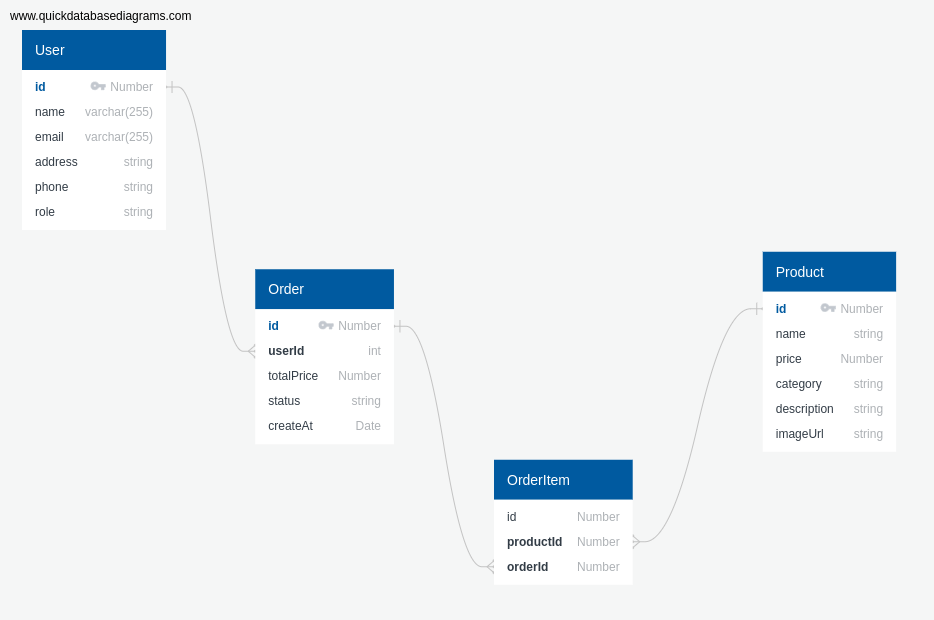

# Restaurante App - Backend

Este é o backend da aplicação **Restaurante App**, desenvolvido com **Node.js** e **TypeORM**, utilizando PostgreSQL como banco de dados.

## Configuração do Ambiente

### Requisitos

- **Node.js** (versão 16 ou superior)
- **PostgreSQL** (versão 13 ou superior)

### Configuração do Banco de Dados

1. **Crie o banco de dados**:  
   Acesse o terminal do PostgreSQL e execute o seguinte comando para criar o banco de dados:
   ```sql
   CREATE DATABASE restaurante_app;
2. **Configure o usuário do banco de dados**:
    - Usuário: postgres
    - Senha: postgres
    
    Se precisar criar ou alterar o usuário:
    ```bash
    CREATE USER postgres WITH PASSWORD 'postgres';
    GRANT ALL PRIVILEGES ON DATABASE restaurante_app TO postgres;
    ```
3. As tabelas do banco serão criadas automaticamente com base nas entidades definidas no projeto, graças à propriedade synchronize: true no arquivo de configuração do TypeORM.

### Configuração do Servidor
1. **Instale as dependências**:  
   Navegue até a pasta do backend e execute:
   ```bash
    npm install
    ```
2. **Inicie o servidor**:
    ```bash
    npm run dev
    ```
    O servidor estará disponível em: http://localhost:3000

## Estrutura do Projeto

### Rotas da API

* **Autenticação:**
  * `/api/auth/register`: Registro de novos usuários.
* **Produtos:**
  * `/api/products`: Gerenciamento de produtos (listagem, criação, atualização, deleção).
* **Pedidos:**
  * `/api/orders`: Criação e visualização de pedidos.

### Modelos de Dados

* **User**
* **Product**
* **Order**
* **OrderItem**

### Diagramas

